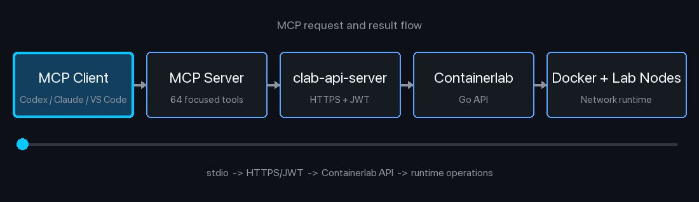

# containerlab-mcp-server


Community MCP server for managing Containerlab environments through the official
Containerlab API Server. It lets MCP-capable AI clients inspect, deploy, start,
stop, and destroy labs without exposing unrestricted shell access.

> [!WARNING]
>
> This is an unofficial and unsupported community project. It is not affiliated
> with, endorsed by, or maintained by the Containerlab project or any network
> equipment vendor. Some tools create or destroy lab resources. Review proposed
> actions, credentials, topology content, and your organization's AI
> data-handling policies before connecting a lab host to an AI assistant.

## Overview

`containerlab-mcp-server` wraps the official Containerlab HTTPS API and exposes
64 focused MCP tools for lab lifecycle, command execution, configuration
artifacts, packet capture, network impairments, topology generation, remote
access, and multi-host network stitching. Once configured, an AI assistant can
answer requests such as:

- "List every Containerlab lab and show node health."
- "Deploy two AOS-CX switches connected on `eth1`."
- "Show the topology YAML for `mixed-cx-ex`."
- "Get the boot logs from node `cx1`."
- "Stop the lab but preserve its dataplane links."
- "Destroy the lab and clean up its generated files."

## Architecture



The MCP server runs locally with the AI client. It authenticates to
`clab-api-server`, caches the returned bearer token for up to one hour, and
re-authenticates once when an API request returns HTTP 401.

## Implemented API Server Features

The implementation follows the feature areas published by
[`srl-labs/clab-api-server`](https://github.com/srl-labs/clab-api-server).
These API server capabilities are currently exposed through MCP:

- **Lab Management:** list, inspect, deploy, start, stop, and destroy labs.
- **Node Operations:** start, stop, restart, pause, unpause, execute commands,
  validate command output, and save configurations.
- **SSH Access:** request temporary SSH access, list sessions, and terminate
  sessions.
- **Terminal Sessions:** create, inspect, and terminate constrained SSH,
  shell, and telnet sessions.
- **Topology Tools:** generate CLOS topologies, generate Draw.io XML, and build
  a two-switch AOS-CX topology object.
- **Network Tools:** inspect interfaces, apply or reset netem impairments, and
  create or delete multi-host VXLAN tunnels.
- **Packet Capture:** inspect or manage EdgeShark and create Packetflix or
  Wireshark/noVNC capture sessions.
- **Health Monitoring:** check API health, host metrics, Containerlab version,
  and available updates.
- **Logs and Events:** read node logs and collect bounded runtime event
  snapshots.
- **Runtime Images:** list, pull, and delete container images.
- **User Context and Multitenancy:** authenticate as a Linux API user and
  preserve server-side ownership and lab visibility boundaries.
- **Standalone Topology Editing:** list and update topology YAML, annotations,
  startup configurations, and scoped lab files.
- **Custom Node Templates:** list, save, replace, select, and delete TopoViewer
  templates.

Destructive or state-changing actions such as `destroy_lab`, `delete_image`,
`execute_node_command`, `set_link_impairment`, file writes/deletes, and template
replacement should only be called after explicit operator approval.

## Tool Categories

### Health and Inventory

| Tool | Description |
| --- | --- |
| `health` | Return API server health |
| `health_metrics` | Return API server CPU, memory, and disk metrics |
| `version` | Return the Containerlab version reported by the API server |
| `version_check` | Check whether a newer Containerlab release is available |
| `list_labs` | List labs visible to the authenticated API user |
| `inspect_lab` | Return node and container state for one lab |
| `list_lab_interfaces` | Return interface details for all nodes or one node |

### Topology and Logs

| Tool | Description |
| --- | --- |
| `get_topology_yaml` | Return a deployed lab's topology YAML |
| `get_node_logs` | Return logs using a short node name or full container name |
| `get_node_browser_ports` | Return exposed node ports suitable for browser access |
| `generate_drawio` | Generate draw.io XML for a deployed topology |

Draw.io generation depends on the external `clab-io-draw` image and may fail
for a one-node topology with no links or position data.

### Lab Lifecycle

| Tool | Description |
| --- | --- |
| `deploy_on_disk_lab` | Deploy topology YAML already stored in the API user's lab directory |
| `deploy_topology_content` | Submit and deploy a topology object through the API |
| `start_lab` | Start all stopped nodes in a deployed lab |
| `stop_lab` | Stop all nodes while preserving dataplane links |
| `destroy_lab` | Destroy a lab with optional cleanup and graceful shutdown |

### Node Lifecycle

| Tool | Description |
| --- | --- |
| `start_node` | Start one stopped node |
| `stop_node` | Stop one node while preserving its links |
| `restart_node` | Restart one node while preserving its links |
| `pause_node` | Pause one running node |
| `unpause_node` | Resume one paused node |

### Commands and Configuration

| Tool | Description |
| --- | --- |
| `execute_lab_command` | Execute a native container command on all or filtered nodes |
| `execute_node_command` | Execute a native container command on one resolved node |
| `validate_node_command` | Check exit status and optional expected output |
| `save_lab_config` | Save running configuration for supported node kinds |

The native exec API runs commands in the node container. It does not translate
vendor configuration intent into Aruba CX or Junos CLI syntax. The caller must
provide the command appropriate to that image and confirm mutating commands.

### Runtime Images

| Tool | Description |
| --- | --- |
| `list_images` | List images in the Containerlab host runtime |
| `pull_image` | Pull a public or pre-authorized image reference |
| `delete_image` | Delete an image after explicit operator approval |

Image pull uses the runtime's existing registry authentication. This project
does not collect registry credentials or build vrnetlab images.

### Packet Capture

| Tool | Description |
| --- | --- |
| `get_edgeshark_status` | Return EdgeShark runtime status |
| `install_edgeshark` | Install/start EdgeShark as an API superuser |
| `uninstall_edgeshark` | Remove EdgeShark as an API superuser |
| `build_packetflix_capture` | Build Packetflix URIs for capture targets |
| `create_wireshark_capture_sessions` | Create Wireshark/noVNC capture sessions |
| `get_capture_session_ready` | Check session readiness and URL |
| `terminate_capture_session` | Terminate one capture session |
| `terminate_all_capture_sessions` | Terminate all visible capture sessions |

The v0.5.1 API exposes capture through EdgeShark Packetflix and proxied
Wireshark/noVNC sessions. It does not expose a direct PCAP download operation.

### Link Impairments

| Tool | Description |
| --- | --- |
| `set_link_impairment` | Apply delay, jitter, loss, rate, or corruption |
| `show_link_impairments` | Inspect active netem settings |
| `reset_link_impairment` | Remove impairment from one interface |

### Topology Documents and Files

| Tool | Description |
| --- | --- |
| `list_topology_files` | List editable topology entries |
| `update_topology_yaml` | Replace a lab topology YAML document |
| `get_topology_annotations` | Read TopoViewer annotations |
| `update_topology_annotations` | Replace TopoViewer annotations |
| `get_topology_file` | Read a scoped lab file |
| `put_topology_file` | Write a scoped lab file or startup configuration |
| `put_startup_config` | Write a startup config under `configs/` and return its path |
| `rename_topology_file` | Rename or move a scoped lab file |
| `delete_topology_file` | Delete a scoped lab file |

Startup configuration support uses `put_topology_file` to store the config and
`update_topology_yaml` to reference it from the intended node.

### Events and Generation

| Tool | Description |
| --- | --- |
| `collect_events` | Collect up to 60 seconds of native NDJSON events |
| `generate_clos_topology` | Generate and optionally deploy a native CLOS topology |

### Custom Node Templates

| Tool | Description |
| --- | --- |
| `list_custom_node_templates` | List the user's TopoViewer templates |
| `save_custom_node_template` | Create or update one template |
| `replace_custom_node_templates` | Replace the full template collection |
| `set_default_custom_node_template` | Select the default template |
| `delete_custom_node_template` | Delete one template |

### Remote Access

| Tool | Description |
| --- | --- |
| `request_ssh_access` | Create temporary external SSH access to one node |
| `list_ssh_sessions` | List temporary SSH sessions visible to the API user |
| `terminate_ssh_session` | Terminate temporary SSH access by allocated port |
| `create_terminal_session` | Create a constrained SSH, shell, or telnet terminal session |
| `get_terminal_session` | Return terminal session metadata and state |
| `terminate_terminal_session` | Terminate a terminal session by ID |

Terminal tools manage session lifecycle and metadata. Interactive terminal data
is transported by the API server's WebSocket stream and is not returned as a
normal MCP tool result.

### Multi-Host Networking

| Tool | Description |
| --- | --- |
| `create_vxlan` | Create a VXLAN tunnel for multi-host dataplane connectivity |
| `delete_vxlan` | Delete VXLAN interfaces matching an approved prefix |

VXLAN operations require an API superuser and matching configuration on the
remote host.

### Topology Helpers

| Tool | Description |
| --- | --- |
| `make_two_switch_aoscx_topology` | Generate, but do not deploy, a linked two-switch AOS-CX topology |

The topology helper defaults to
`vrnetlab/aruba_arubaos-cx:10.17.1010`. Pass a different image tag when
required by your environment.

## Example Questions

Try these in an MCP-capable AI client:

```text
Check the Containerlab API health and version.
Check whether a newer Containerlab version is available.
List all labs and summarize unhealthy nodes.
Inspect the mixed-cx-ex lab.
Show every interface in mixed-cx-ex.
Show the topology YAML for mixed-cx-ex.
Get the last logs from node ex1 in mixed-cx-ex.
Generate a horizontal draw.io diagram for mixed-cx-ex.
Restart only node ex1 and wait until it becomes healthy.
List all runtime images on the lab host.
Pull ghcr.io/srl-labs/alpine:latest.
Create temporary SSH access to cx1 for 30 minutes.

Generate a two-switch AOS-CX topology called cx-demo using eth1.
Deploy the generated AOS-CX topology.
Deploy the topology stored at /home/lab/topologies/demo.clab.yml.
Stop cx-demo while preserving its links.
Start cx-demo and verify every node becomes healthy.
Destroy cx-demo and clean up its generated lab directory.

Create a VXLAN with VNI 100 from cx1-eth1 to remote host 192.0.2.20.
```

## Prerequisites

- Python 3.11 or newer
- [`uv`](https://docs.astral.sh/uv/)
- An accessible
  [Containerlab API Server](https://containerlab.dev/manual/api-server/)
- A Containerlab API user with permission to access the required labs
- Docker images for every node referenced by submitted topologies

The MCP server does not build or pull private network operating system images
for you. Prepare those images on the Containerlab host first.

## Setup

Clone the repository and install its dependencies:

```bash
git clone https://github.com/teze3808/containerlab-mcp-server.git
cd containerlab-mcp-server
uv sync
```

Create a local environment file:

```bash
cp .env.example .env
```

Edit `.env` with your API server details:

```env
CLAB_API_URL=https://containerlab-host.example:8090
CLAB_USERNAME=your-username
CLAB_PASSWORD=your-password
CLAB_VERIFY_TLS=false
CLAB_TIMEOUT=60
```

Do not commit `.env`. Set `CLAB_VERIFY_TLS=true` when the API server uses a
certificate trusted by the MCP client host.

## Run Locally

```bash
uv run containerlab-mcp
```

Run the test suite:

```bash
uv run pytest
```

## MCP Client Configuration

### Codex

Add this to the Codex MCP configuration after replacing the placeholders:

```toml
[mcp_servers.containerlab]
command = "uv"
args = ["run", "--directory", "/path/to/containerlab-mcp-server", "containerlab-mcp"]
startup_timeout_sec = 30

[mcp_servers.containerlab.env]
CLAB_API_URL = "https://containerlab-host.example:8090"
CLAB_USERNAME = "your-username"
CLAB_PASSWORD = "your-password"
CLAB_VERIFY_TLS = "false"
CLAB_TIMEOUT = "60"
```

Restart Codex after editing the configuration.

### Claude Desktop

Add this server entry to the Claude Desktop MCP configuration:

```json
{
  "mcpServers": {
    "containerlab": {
      "command": "uv",
      "args": [
        "run",
        "--directory",
        "/path/to/containerlab-mcp-server",
        "containerlab-mcp"
      ],
      "env": {
        "CLAB_API_URL": "https://containerlab-host.example:8090",
        "CLAB_USERNAME": "your-username",
        "CLAB_PASSWORD": "your-password",
        "CLAB_VERIFY_TLS": "false",
        "CLAB_TIMEOUT": "60"
      }
    }
  }
}
```

Restart Claude Desktop after editing its configuration.

### Claude Code

Claude Code can add the stdio MCP server from JSON:

```bash
claude mcp add-json containerlab '{
  "type": "stdio",
  "command": "uv",
  "args": ["run", "--directory", "/path/to/containerlab-mcp-server", "containerlab-mcp"],
  "env": {
    "CLAB_API_URL": "https://containerlab-host.example:8090",
    "CLAB_USERNAME": "your-username",
    "CLAB_PASSWORD": "your-password",
    "CLAB_VERIFY_TLS": "false",
    "CLAB_TIMEOUT": "60"
  }
}'
```

### Visual Studio Code with GitHub Copilot

VS Code stores MCP configuration in `.vscode/mcp.json` or the user profile:

```json
{
  "servers": {
    "containerlab": {
      "type": "stdio",
      "command": "uv",
      "args": [
        "run",
        "--directory",
        "/path/to/containerlab-mcp-server",
        "containerlab-mcp"
      ],
      "env": {
        "CLAB_API_URL": "https://containerlab-host.example:8090",
        "CLAB_USERNAME": "your-username",
        "CLAB_PASSWORD": "your-password",
        "CLAB_VERIFY_TLS": "false",
        "CLAB_TIMEOUT": "60"
      }
    }
  }
}
```

Save the file and reload or restart the MCP server in VS Code.

### Generic Stdio MCP Client

Run this command from the project directory:

```bash
uv run containerlab-mcp
```

Pass the `CLAB_*` environment variables through the MCP client's server
configuration.

## Notes

- `get_node_logs` accepts `cx1` or a full name such as
  `clab-aoscx-two-switch-cx1`.
- Node lifecycle, browser-port, SSH, and terminal tools also accept short node
  names and resolve them to full container names.
- Labs returned by the API are limited by the authenticated user's access.
- A submitted topology must reference images already available to Docker on the
  Containerlab host, or images that Docker is authorized to pull.
- `stop_lab` preserves the deployed lab and dataplane links; `destroy_lab`
  removes the deployment.
- `delete_image`, `destroy_lab`, and `delete_vxlan` are destructive operations.
- Listing all users' SSH sessions and managing VXLAN tunnels may require an API
  superuser.
- Self-signed API certificates are common in labs. Prefer a trusted certificate
  where possible instead of leaving TLS verification disabled.
- This project is intended for lab, demo, validation, and operational-assist
  workflows. Apply appropriate review and change control before adapting it for
  shared environments.

## Documentation

- [Containerlab API Server](https://containerlab.dev/manual/api-server/)
- [Containerlab documentation](https://containerlab.dev/)
- [Model Context Protocol](https://modelcontextprotocol.io/)
- [Claude Code MCP documentation](https://code.claude.com/docs/en/mcp)
- [VS Code MCP configuration reference](https://code.visualstudio.com/docs/copilot/reference/mcp-configuration)
