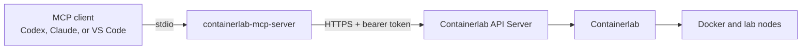

# containerlab-mcp-server


Community MCP server for managing Containerlab environments through the official
Containerlab API Server. It lets MCP-capable AI clients inspect, deploy, start,
stop, and destroy labs without exposing unrestricted shell access.

> [!WARNING]
>
> This is an unofficial and unsupported community project. It is not affiliated
> with, endorsed by, or maintained by the Containerlab project or any network
> equipment vendor. Some tools create or destroy lab resources. Review proposed
> actions, credentials, topology content, and your organization's AI
> data-handling policies before connecting a lab host to an AI assistant.

## Overview

`containerlab-mcp-server` wraps the official Containerlab HTTPS API and exposes
focused MCP tools for lab lifecycle and operational visibility. Once configured,
an AI assistant can answer requests such as:

- "List every Containerlab lab and show node health."
- "Deploy two AOS-CX switches connected on `eth1`."
- "Show the topology YAML for `mixed-cx-ex`."
- "Get the boot logs from node `cx1`."
- "Stop the lab but preserve its dataplane links."
- "Destroy the lab and clean up its generated files."

## Architecture



The MCP server runs locally with the AI client. It authenticates to
`clab-api-server`, caches the returned bearer token for up to one hour, and
re-authenticates once when an API request returns HTTP 401.

## Operational Scope

This project intentionally exposes focused Containerlab operations instead of a
generic remote shell.

- Implemented: API health, metrics, version, lab inventory, topology, and logs.
- Implemented: deploy, start, stop, and destroy lab lifecycle operations.
- Implemented: a helper that generates a two-switch AOS-CX topology object.
- Not implemented: arbitrary host command execution.
- Not implemented: SSH/CLI configuration inside network devices.
- Not implemented: image download, conversion, or vrnetlab Docker image builds.

Destructive actions such as `destroy_lab` should only be called after explicit
operator approval.

## APIs Used

The server currently uses these Containerlab API Server endpoints:

```text
POST   /login
GET    /health
GET    /api/v1/health/metrics
GET    /api/v1/version
GET    /api/v1/labs
POST   /api/v1/labs
GET    /api/v1/labs/{lab_name}
POST   /api/v1/labs/{lab_name}/deploy
POST   /api/v1/labs/{lab_name}/start
POST   /api/v1/labs/{lab_name}/stop
DELETE /api/v1/labs/{lab_name}
GET    /api/v1/labs/{lab_name}/topology/yaml
GET    /api/v1/labs/{lab_name}/nodes/{container_name}/logs
```

## Tool Categories

### Health and Inventory

| Tool | Description |
| --- | --- |
| `health` | Return API server health |
| `health_metrics` | Return API server CPU, memory, and disk metrics |
| `version` | Return the Containerlab version reported by the API server |
| `list_labs` | List labs visible to the authenticated API user |
| `inspect_lab` | Return node and container state for one lab |

### Topology and Logs

| Tool | Description |
| --- | --- |
| `get_topology_yaml` | Return a deployed lab's topology YAML |
| `get_node_logs` | Return logs using a short node name or full container name |

### Lab Lifecycle

| Tool | Description |
| --- | --- |
| `deploy_on_disk_lab` | Deploy topology YAML already stored in the API user's lab directory |
| `deploy_topology_content` | Submit and deploy a topology object through the API |
| `start_lab` | Start all stopped nodes in a deployed lab |
| `stop_lab` | Stop all nodes while preserving dataplane links |
| `destroy_lab` | Destroy a lab with optional cleanup and graceful shutdown |

### Topology Helpers

| Tool | Description |
| --- | --- |
| `make_two_switch_aoscx_topology` | Generate, but do not deploy, a linked two-switch AOS-CX topology |

The topology helper defaults to
`vrnetlab/aruba_arubaos-cx:10.17.1010`. Pass a different image tag when
required by your environment.

## Example Questions

Try these in an MCP-capable AI client:

```text
Check the Containerlab API health and version.
List all labs and summarize unhealthy nodes.
Inspect the mixed-cx-ex lab.
Show the topology YAML for mixed-cx-ex.
Get the last logs from node ex1 in mixed-cx-ex.

Generate a two-switch AOS-CX topology called cx-demo using eth1.
Deploy the generated AOS-CX topology.
Deploy the topology stored at /home/lab/topologies/demo.clab.yml.
Stop cx-demo while preserving its links.
Start cx-demo and verify every node becomes healthy.
Destroy cx-demo and clean up its generated lab directory.
```

## Prerequisites

- Python 3.11 or newer
- [`uv`](https://docs.astral.sh/uv/)
- An accessible
  [Containerlab API Server](https://containerlab.dev/manual/api-server/)
- A Containerlab API user with permission to access the required labs
- Docker images for every node referenced by submitted topologies

The MCP server does not build or pull private network operating system images
for you. Prepare those images on the Containerlab host first.

## Setup

Clone the repository and install its dependencies:

```bash
git clone https://github.com/teze3808/containerlab-mcp-server.git
cd containerlab-mcp-server
uv sync
```

Create a local environment file:

```bash
cp .env.example .env
```

Edit `.env` with your API server details:

```env
CLAB_API_URL=https://containerlab-host.example:8090
CLAB_USERNAME=your-username
CLAB_PASSWORD=your-password
CLAB_VERIFY_TLS=false
CLAB_TIMEOUT=60
```

Do not commit `.env`. Set `CLAB_VERIFY_TLS=true` when the API server uses a
certificate trusted by the MCP client host.

## Run Locally

```bash
uv run containerlab-mcp
```

Run the test suite:

```bash
uv run pytest
```

## MCP Client Configuration

### Codex

Add this to the Codex MCP configuration after replacing the placeholders:

```toml
[mcp_servers.containerlab]
command = "uv"
args = ["run", "--directory", "/path/to/containerlab-mcp-server", "containerlab-mcp"]
startup_timeout_sec = 30

[mcp_servers.containerlab.env]
CLAB_API_URL = "https://containerlab-host.example:8090"
CLAB_USERNAME = "your-username"
CLAB_PASSWORD = "your-password"
CLAB_VERIFY_TLS = "false"
CLAB_TIMEOUT = "60"
```

Restart Codex after editing the configuration.

### Claude Desktop

Add this server entry to the Claude Desktop MCP configuration:

```json
{
  "mcpServers": {
    "containerlab": {
      "command": "uv",
      "args": [
        "run",
        "--directory",
        "/path/to/containerlab-mcp-server",
        "containerlab-mcp"
      ],
      "env": {
        "CLAB_API_URL": "https://containerlab-host.example:8090",
        "CLAB_USERNAME": "your-username",
        "CLAB_PASSWORD": "your-password",
        "CLAB_VERIFY_TLS": "false",
        "CLAB_TIMEOUT": "60"
      }
    }
  }
}
```

Restart Claude Desktop after editing its configuration.

### Claude Code

Claude Code can add the stdio MCP server from JSON:

```bash
claude mcp add-json containerlab '{
  "type": "stdio",
  "command": "uv",
  "args": ["run", "--directory", "/path/to/containerlab-mcp-server", "containerlab-mcp"],
  "env": {
    "CLAB_API_URL": "https://containerlab-host.example:8090",
    "CLAB_USERNAME": "your-username",
    "CLAB_PASSWORD": "your-password",
    "CLAB_VERIFY_TLS": "false",
    "CLAB_TIMEOUT": "60"
  }
}'
```

### Visual Studio Code with GitHub Copilot

VS Code stores MCP configuration in `.vscode/mcp.json` or the user profile:

```json
{
  "servers": {
    "containerlab": {
      "type": "stdio",
      "command": "uv",
      "args": [
        "run",
        "--directory",
        "/path/to/containerlab-mcp-server",
        "containerlab-mcp"
      ],
      "env": {
        "CLAB_API_URL": "https://containerlab-host.example:8090",
        "CLAB_USERNAME": "your-username",
        "CLAB_PASSWORD": "your-password",
        "CLAB_VERIFY_TLS": "false",
        "CLAB_TIMEOUT": "60"
      }
    }
  }
}
```

Save the file and reload or restart the MCP server in VS Code.

### Generic Stdio MCP Client

Run this command from the project directory:

```bash
uv run containerlab-mcp
```

Pass the `CLAB_*` environment variables through the MCP client's server
configuration.

## Notes

- `get_node_logs` accepts `cx1` or a full name such as
  `clab-aoscx-two-switch-cx1`.
- Labs returned by the API are limited by the authenticated user's access.
- A submitted topology must reference images already available to Docker on the
  Containerlab host, or images that Docker is authorized to pull.
- `stop_lab` preserves the deployed lab and dataplane links; `destroy_lab`
  removes the deployment.
- Self-signed API certificates are common in labs. Prefer a trusted certificate
  where possible instead of leaving TLS verification disabled.
- This project is intended for lab, demo, validation, and operational-assist
  workflows. Apply appropriate review and change control before adapting it for
  shared environments.

## Documentation

- [Containerlab API Server](https://containerlab.dev/manual/api-server/)
- [Containerlab documentation](https://containerlab.dev/)
- [Model Context Protocol](https://modelcontextprotocol.io/)
- [Claude Code MCP documentation](https://code.claude.com/docs/en/mcp)
- [VS Code MCP configuration reference](https://code.visualstudio.com/docs/copilot/reference/mcp-configuration)
